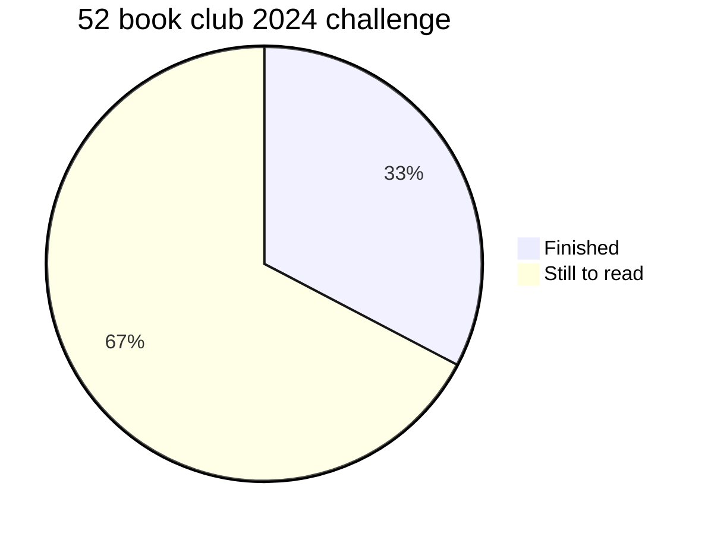

[list of 2024 reading challenges](https://candidcover.net/2024-reading-challenges-list/)


### 52 book club 2024 challenge
*books for this challenge are tagged with #52books24*

<!-- ```goat
.--+--+--+--+--+--+--+--+--+--+--+--+--.
|1 |2 |3 |4 |5 |6 |7 |8 |9 |10|11|12|13|
+--+--+--+--+--+--+--+--+--+--+--+--+--.  
|14|15|16|17|18|19|20|21|22|23|24|25|26|   
+--+--+--+--+--+--+--+--+--+--+--+--+--.    
|27|28|29|30|31|x |33|34|35|36|37|38|39|
+--+--+--+--+--+--+--+--+--+--+--+--+--.
|40|41|42|43|44|45|46|47|48|49|50|51|52|   
'--+--+--+--+--+--+--+--+--+--+--+--+--' 
``` -->


**link** -> https://www.the52book.club/2024-reading-challenge/

**challenge guide link** -> https://www.the52book.club/2024-challenge-guide/

| Prompt                            | Book                                                                      |
|-----------------------------------|---------------------------------------------------------------------------|
| 4. Lowercase letters on the spine | [ Before the coffee gets cold ]()    |
| 7. At least 4 different POV       | [ Let the Great World Spin ]()          |
| 8. Features the ocean       | [ The Perfect Storm ]()                            |
| 9. A character-driven novel       | [ Babel: An Arcane History ]()                         |
| 10. Told in non-chronological order       | [ Educated ]()                              |
| 11. Title starting with the letter "K"  | [ Killers of the Flower Moon ]() |
| 25. An author "everyone" has read except you     | [ Dune Messiah ]()                |
| 26. Hybrid genre                  | [ The Complete Maus ]()                                 |
| 28. A yellow spine                  | [ Somewhere Beyond the Sea ]()       |
| 30. Picked without reading the blurb    | [ The God of Small Things ]()          |
| 36. Has futuristic technology      | [ Foundryside ]()                               |
| 38. Published by Hachette    | [ The Memoirs of Stockholm Sven ]()      |
| 41. A sticker on the cover   | [ Tom Lake ]()                                            |
| 43. About finding identity            | [ The Boys in the Boat ]()                  |
| 44. Includes a wedding            | [ The Princess Bride ]()                        |
| 45. Chapter headings have dates   | [ The Dictionary of Lost Words ]()     |
| 50. A musical instrument on the cover   | [ King Zeno ]()                               |



### read the alphabet
*books for this challenge are tagged with #abc24*

A. \
B. [ Before the coffee gets cold ]() \
C. \
D. [ The Dictionary of Lost Words ]() \
E. [ Educated ]() \
F. [ Foundryside ]() \
G. [ The God of Small Things ]() \
H. \
I. \
J. \
K. [ Killers of the Flower Moon ]() \
L. [ Let the Great World Spin ]() \
M. [ Midnight in the Garden of Good and Evil ]() \
N. \
O. [ Our Hideous Progeny ]() \
P. \
Q. \
R. \
S. [ Somewhere Beyond the Sea ]() \
T. [ Tom Lake ]() \
U. [ Unbroken ]() \
V. \
W. [ Watchmen ]() \
X. \
Y. \
Z.


### other challenges i am using for inspiration

[Austine Decker's Beat the Backlist](https://austinedecker.com/beat-the-backlist/)


### last year
[ 2023 reading ]()